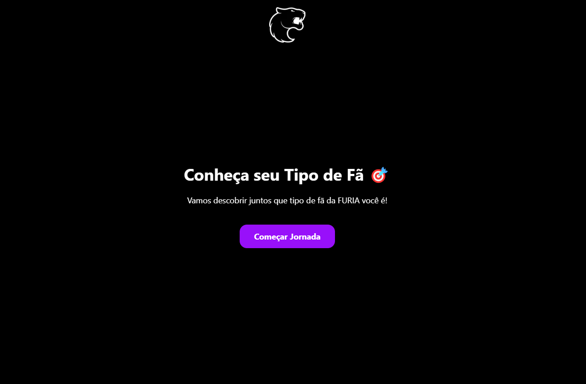
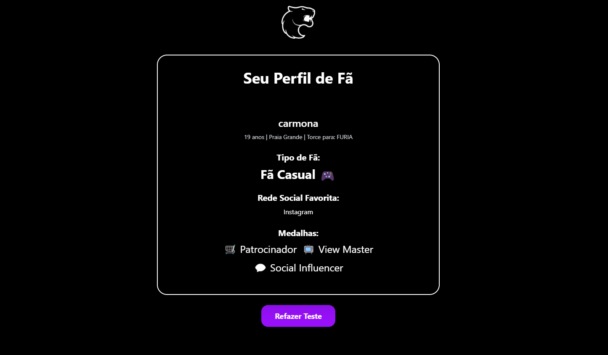

# Know Your Fan - Desafio FURIA 🐆

Este projeto foi desenvolvido para o **Desafio FURIA** (Challenge #2 - Know Your Fan).  
A ideia é criar uma solução que entenda mais sobre o fã da FURIA, utilizando dados pessoais, redes sociais e interações.

---

## 🔥 Sobre o Projeto

O **Know Your Fan** é um aplicativo que coleta informações do usuário para montar o perfil do fã:  
- Dados pessoais (nickname, idade, cidade, time favorito)
- Redes sociais favoritas
- Interesses nos times da FURIA
- Engajamento social
- Interações com a organização

Com essas informações, o app gera um **perfil personalizado**, identifica o **tipo de fã** e apresenta **medalhas** exclusivas.

---

## 📸 Preview




> (Você pode colocar prints do app depois, ou deixar para adicionar depois da entrega)

---

## 🚀 Tecnologias utilizadas

- [Next.js 14](https://nextjs.org/)
- [React 18](https://react.dev/)
- [TypeScript](https://www.typescriptlang.org/)
- [Tailwind CSS](https://tailwindcss.com/)
- [html2canvas](https://html2canvas.hertzen.com/) *(não utilizado na versão final, mas considerado)*
- [Vercel](https://vercel.com/)

---

## 🛠️ Como rodar localmente

Clone o projeto:

```bash
git clone https://github.com/seu-usuario/know-your-fan.git
cd know-your-fan
```

Instale as dependências:

```bash
npm install
```

Rode o projeto:

```bash
npm run dev
```

Abra no navegador:

```bash
http://localhost:3000
```

---

## 📄 Funcionalidades

- Cadastro rápido de perfil
- Escolha de rede social preferida
- Coleta de interesses nos times e modalidades da FURIA
- Perguntas de engajamento e comportamento social
- Geração de perfil de fã:
  - Fã Hardcore 🔥
  - Fã Casual 🎮
  - Simpatizante 👀
- Exibição de medalhas especiais 🏅
- Visual bonito com tema dark e logo oficial da FURIA

---

## 📢 Observações

- Todos os dados são simulados apenas no **frontend** (Context API + LocalStorage).
- Não existe backend real.
- Não é necessário autenticação.

---

> Este projeto foi criado exclusivamente para fins de demonstração no desafio da FURIA.

